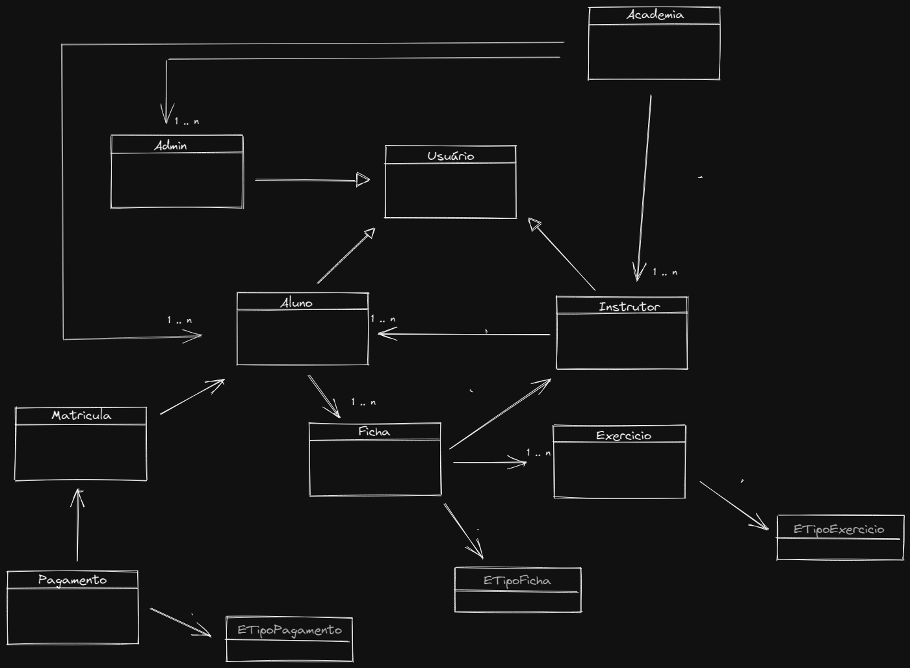

# SISTEMA DE ACADEMIA
## TRABALHO 2 BIMESTRE - POO

O projeto foi um trabalho realizado para disciplina de Programação Orientada a Objetos em Java usando componentes de tela do JavaSwing e banco de dados MySQL

### DIAGRAMA DE CLASSES:

